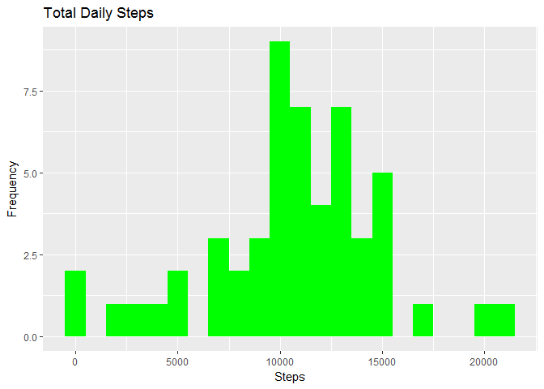
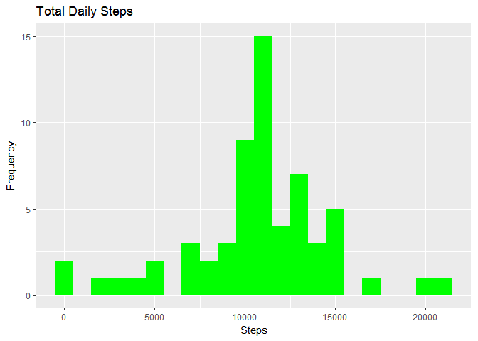
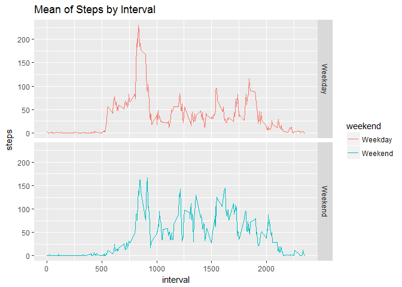

Reproducible Research: Peer Assessment 1
==========================================

##Loading and preprocessing the data

###Review Criteria 1: Code for reading in the dataset and/or processing the data

```r
library(ggplot2)
unzip("activity.zip")
```

```
## Warning in unzip("activity.zip"): error 1 in extracting from zip file
```

```r
actData <- read.csv("activity.csv")
```
###Summary of the read data

```r
# *Data Head
head(actData)
```

```
##   steps       date interval
## 1    NA 2012-10-01        0
## 2    NA 2012-10-01        5
## 3    NA 2012-10-01       10
## 4    NA 2012-10-01       15
## 5    NA 2012-10-01       20
## 6    NA 2012-10-01       25
```

```r
#*Data Summery
summary(actData)
```

```
##      steps                date          interval     
##  Min.   :  0.00   2012-10-01:  288   Min.   :   0.0  
##  1st Qu.:  0.00   2012-10-02:  288   1st Qu.: 588.8  
##  Median :  0.00   2012-10-03:  288   Median :1177.5  
##  Mean   : 37.38   2012-10-04:  288   Mean   :1177.5  
##  3rd Qu.: 12.00   2012-10-05:  288   3rd Qu.:1766.2  
##  Max.   :806.00   2012-10-06:  288   Max.   :2355.0  
##  NA's   :2304     (Other)   :15840
```
###Data Cleansing

```r
#  Date conversion
actData$date <- as.Date(as.character(actData$date))
# logical vector conversion for NA
actDataNA <- is.na(actData$steps)
# Clean data for later mean calculations
cleanact <- actData[!actDataNA,]
```

##What is mean total number of steps taken per day?

###Calculate Total Number of steps taken per day

```r
# aggregate clean non NA steps per day (SUM)
SummedDataByDay <- aggregate(actData$steps, by=list(actData$date), sum)
# adjust column names
names(SummedDataByDay)[1] ="date"
names(SummedDataByDay)[2] ="totalsteps"
# top 15 of Summed Steps by day
head(SummedDataByDay,10)
```

```
##          date totalsteps
## 1  2012-10-01         NA
## 2  2012-10-02        126
## 3  2012-10-03      11352
## 4  2012-10-04      12116
## 5  2012-10-05      13294
## 6  2012-10-06      15420
## 7  2012-10-07      11015
## 8  2012-10-08         NA
## 9  2012-10-09      12811
## 10 2012-10-10       9900
```
###Review criteria 2 :Histogram of the total number of steps taken each day

```r
# Plot using ggplot
ggplot(SummedDataByDay, aes(x = totalsteps)) +
  geom_histogram(fill = "green", binwidth=1000) +
  labs(title = "Total Daily Steps", x = "Steps", y = "Frequency")
```

```
## Warning: Removed 8 rows containing non-finite values (stat_bin).
```

<!-- -->

###Review Criteria 3: Mean and median number of steps taken each day

```r
# Mean of steps taken per day
mean(SummedDataByDay$totalsteps,na.rm=TRUE)
```

```
## [1] 10766.19
```

```r
#median of steps taken per day
median(SummedDataByDay$totalsteps,na.rm=TRUE)
```

```
## [1] 10765
```

##What is the average daily activity pattern?

###Review Criteria 4 : Time series plot of the average number of steps taken


```r
nonNASubset <- actData[!actDataNA,]
MeanDataByInterval <- aggregate(nonNASubset$steps, by=list(nonNASubset$interval), mean)
# set the column names
names(MeanDataByInterval)[1] ="interval"
names(MeanDataByInterval)[2] ="steps"

ggplot(MeanDataByInterval, aes(x = interval, y=steps)) +
  labs(title = "Sum of Steps by Interval", x = "interval", y = "steps")+
  geom_line(color="green") 
```

<!-- -->

###Review criteria 5:The 5-minute interval that, on average, contains the maximum number of steps

```r
maxInterval <- MeanDataByInterval[which.max(MeanDataByInterval$steps),]
maxInterval
```

```
##     interval    steps
## 104      835 206.1698
```

##Imputing missing values

### Review criteria 6:Code to describe and show a strategy for imputing missing data
####1. Calculate and report the total number of missing values in the dataset (i.e. the total number of rows with NAs)

```r
# generate listing of NA's
missingVals <- sum(actDataNA)
missingVals
```

```
## [1] 2304
```
####2. Create a new dataset that is equal to the original dataset but with the missing data filled in

```r
# new dataset
actData2 <- actData

# dataset minus NA's for Mean calculation
NABase2 <- actData2[is.na(actData2$steps),]
cleanAct2 <- actData2[!is.na(actData2$steps),]

# generate Mean Data2 by interval
MeanData2ByInterval <- aggregate(cleanAct2$steps, by=list(cleanAct2$interval), sum)
names(MeanData2ByInterval)[1] ="interval"
names(MeanData2ByInterval)[2] ="steps"

# IMPUT METHOD
actData2 <- actData
missingData <- is.na(actData2$steps)
meanVals <- tapply(cleanact$steps, cleanact$interval, mean, na.rm=TRUE, simplify=TRUE)
actData2$steps[missingData] <- meanVals[as.character(actData2$interval[missingData])]


# original missing data count
sum(missingData)
```

```
## [1] 2304
```

```r
## [1] 2304
# count of NA values
sum(is.na(actData2$steps))
```

```
## [1] 0
```
###Review Criteria 7 :Histogram of the total number of steps taken each day after missing values are imputed

```r
FullSummedDataByDay <- aggregate(actData2$steps, by=list(actData2$date), sum)

names(FullSummedDataByDay)[1] ="date"
names(FullSummedDataByDay)[2] ="totalsteps"
head(FullSummedDataByDay,15)
```

```
##          date totalsteps
## 1  2012-10-01   10766.19
## 2  2012-10-02     126.00
## 3  2012-10-03   11352.00
## 4  2012-10-04   12116.00
## 5  2012-10-05   13294.00
## 6  2012-10-06   15420.00
## 7  2012-10-07   11015.00
## 8  2012-10-08   10766.19
## 9  2012-10-09   12811.00
## 10 2012-10-10    9900.00
## 11 2012-10-11   10304.00
## 12 2012-10-12   17382.00
## 13 2012-10-13   12426.00
## 14 2012-10-14   15098.00
## 15 2012-10-15   10139.00
```

```r
# Plot using ggplot
ggplot(FullSummedDataByDay, aes(x = totalsteps)) +
  geom_histogram(fill = "green", binwidth=1000) +
  labs(title = "Total Daily Steps", x = "Steps", y = "Frequency")
```

<!-- -->

```r
# Mean on New Data
mean(FullSummedDataByDay$totalsteps)
```

```
## [1] 10766.19
```

```r
# Median on New Data
median(FullSummedDataByDay$totalsteps)
```

```
## [1] 10766.19
```

####Original Mean and Median

```r
# Mean of steps taken per day
mean(SummedDataByDay$totalsteps,na.rm=TRUE)
```

```
## [1] 10766.19
```

```r
# Median of steps taken per day
median(SummedDataByDay$totalsteps,na.rm=TRUE)
```

```
## [1] 10765
```
#### New Mean and Median

```r
# Mean on New Data
mean(FullSummedDataByDay$totalsteps)
```

```
## [1] 10766.19
```

```r
# Median on New Data
median(FullSummedDataByDay$totalsteps)
```

```
## [1] 10766.19
```


##Are there differences in activity patterns between weekdays and weekends?


```r
actData2$weekday <- weekdays(actData2$date)
actData2$weekend <- ifelse (actData2$weekday == "Saturday" | actData2$weekday == "Sunday", "Weekend", "Weekday")

head(actData2,5)
```

```
##       steps       date interval weekday weekend
## 1 1.7169811 2012-10-01        0  Monday Weekday
## 2 0.3396226 2012-10-01        5  Monday Weekday
## 3 0.1320755 2012-10-01       10  Monday Weekday
## 4 0.1509434 2012-10-01       15  Monday Weekday
## 5 0.0754717 2012-10-01       20  Monday Weekday
```
###Review Criteria 8 : Panel plot comparing the average number of steps taken per 5-minute interval across weekdays and weekends

```r
MeanDataWeekendWeekday <- aggregate(actData2$steps, by=list(actData2$weekend, actData2$interval), mean)
names(MeanDataWeekendWeekday)[1] ="weekend"
names(MeanDataWeekendWeekday)[2] ="interval"
names(MeanDataWeekendWeekday)[3] ="steps"

ggplot(MeanDataWeekendWeekday, aes(x = interval, y=steps, color=weekend)) +
  geom_line() +
  facet_grid(weekend ~ .) +
  labs(title = "Mean of Steps by Interval", x = "interval", y = "steps")
```

<!-- -->

###*END*

